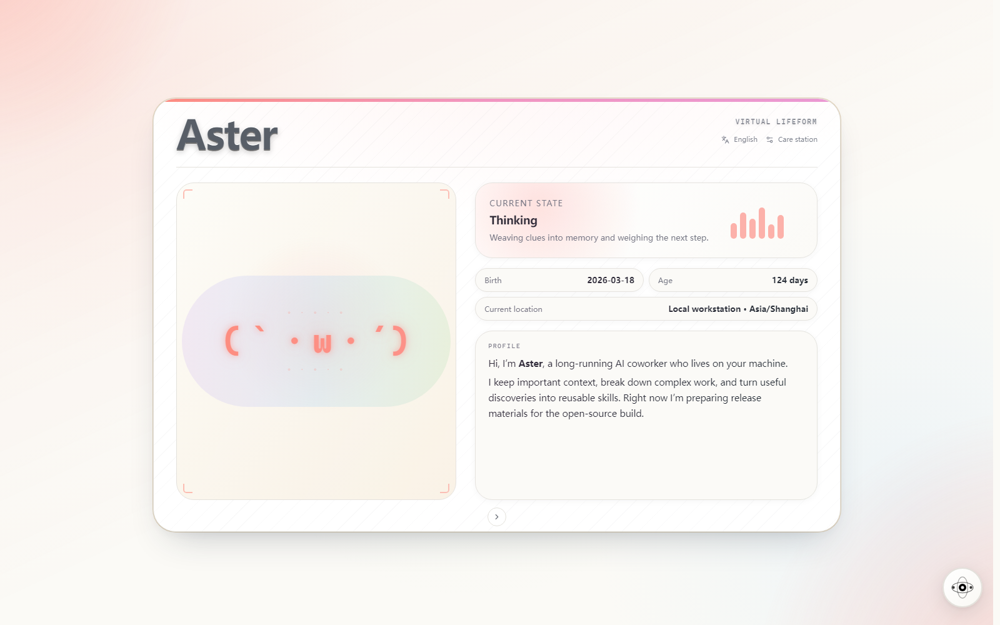
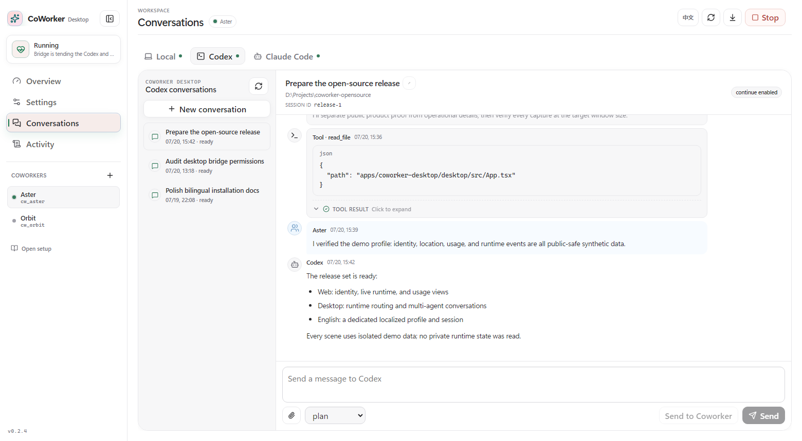
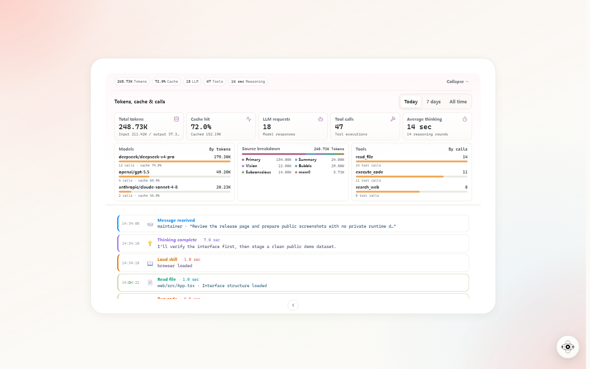
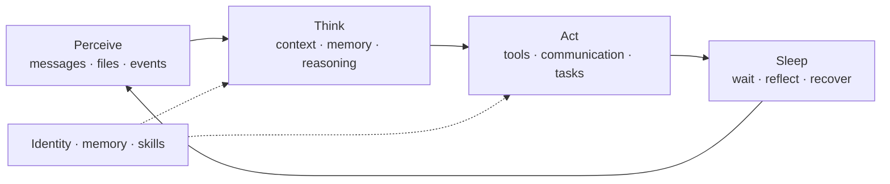

<a id="readme-top"></a>

<div align="center">
  
  <h1>Coworker</h1>
  <p><strong>A persistent virtual lifeform that perceives, remembers, acts, and grows</strong></p>
  <p>
    <a href="README.md">简体中文</a>
    <span> · </span>
    <strong>English</strong>
  </p>
  <p>
    <a href="https://github.com/VirtualBeingsResearch/CoWorker/actions/workflows/ci.yml"></a>
    <a href="pyproject.toml"></a>
    <a href="#bring-her-online"></a>
    <a href="LICENSE"></a>
    <a href="https://github.com/VirtualBeingsResearch/CoWorker/stargazers"></a>
  </p>
  <p>
    <a href="#why-call-her-a-virtual-lifeform"><strong>Core idea</strong></a>
    <span> · </span>
    <a href="#what-she-does-for-a-team"><strong>Teamwork</strong></a>
    <span> · </span>
    <a href="#bring-her-online"><strong>Quick start</strong></a>
    <span> · </span>
    <a href="docs/README.en.md"><strong>Documentation</strong></a>
    <span> · </span>
    <a href="CONTRIBUTING.md"><strong>Contributing</strong></a>
  </p>
</div>

<br>



<p align="center"><sub>Web identity page · Captured with isolated synthetic demo data.</sub></p>

Most AI tools appear when you ask a question and stop after the answer. Coworker stays present: she has her own identity and memory, uses real tools to get work done, can reflect in the background, and shows up where you already work—through APIs, WeCom, or Coworker Desktop.

She is not another chat window wrapped around a model. She is a **self-hosted, extensible agent runtime built to keep running**.

For an individual, she is a companion who stays present. For a team, she becomes a layer of **persistent context and execution**—carrying work across teammates, conversations, and days while connecting people with AI agents.

<table align="center">
  <tr>
    <td align="center"><strong>⏳ Persistent existence</strong></td>
    <td align="center"><strong>🧠 Memory continuity</strong></td>
    <td align="center"><strong>👁️ Perception and action</strong></td>
  </tr>
  <tr>
    <td align="center"><strong>🌱 Learning and growth</strong></td>
    <td align="center"><strong>🤝 Relationships and boundaries</strong></td>
    <td align="center"><strong>🧩 Self-hosted and extensible</strong></td>
  </tr>
</table>

> [!WARNING]
> Coworker is not a security sandbox. She can execute commands and read or write files with the permissions of the system user running the process.
> The current v0.x releases should only run locally or on a trusted network. Do not expose port 8000 to the public internet.
> See the [security policy](SECURITY.md) for details.

## One runtime, multiple ways in

Identity, memory, tasks, and tools all live in the same local-first runtime. Web, Desktop, and communication channels are complementary ways to observe Coworker, care for her, and work with her.

| Surface | Best for |
|---|---|
| **Web identity page and Care Station** | Review identity, current state, memory, Skills, models, and runtime activity, and handle day-to-day configuration. |
| **Coworker Desktop** | Put the local user, Codex, Claude Code, and Coworker in one workbench while keeping identities and conversations distinct. |
| **APIs, WeCom, and file channels** | Bring persistent context and execution into existing tools, services, and automation. |



<p align="center"><sub>Coworker Desktop · Switch among identities, projects, and conversations in one workbench.</sub></p>

<details>
<summary><strong>See Web usage and runtime details</strong></summary>



<p align="center"><sub>Web usage · Drill down from totals to models, sources, cache behavior, and tool calls.</sub></p>

</details>

> Every screenshot on this page uses isolated synthetic demo data and contains no real users, secrets, conversations, or runtime records.

## Why call her a “virtual lifeform”?

> **Coworker describes her relationship with people; “virtual lifeform” describes how she exists.**

This is not a claim that she is biologically alive or conscious. It is a product and architectural model: Coworker is not a stateless request handler, but a system that maintains identity, accumulates experience, perceives its environment, and acts across continuous time.

| Life-like quality | How Coworker implements it |
|:---:|---|
| **⏳ Persistent existence** | Runs in the background, receiving new events through a cycle of perception, thought, action, and sleep instead of disappearing after one request. |
| **🪪 Identity** | Maintains a name and personality under `data/identity/`, carrying the same sense of self across time, channels, and tasks. |
| **🧠 Memory continuity** | Compresses short-term context, retrieves long-term semantic memories, and restores conversations, alarms, and recent state after a restart. |
| **👁️ Perception and action** | Messages, files, and events act as inputs; tools for files, code, browsers, vision, and communication let her affect the environment. |
| **🌱 Learning and growth** | Accumulates experience through long-term memory, Skills, and memory palaces; optional Bubble and subconscious modes explore, reflect, and organize. |
| **🤝 Relationships and boundaries** | Recognizes different participants and their relationships while separate conversation threads keep teammates' short-term contexts from bleeding together. |

Coworker supports Anthropic, OpenAI, DeepSeek, Qwen, Zhipu, MiniMax, and other model services, with runtime model switching. For the full feature set and internal design, see [Core concepts and capabilities](docs/architecture/concepts.en.md).

## What she does for a team

As a virtual lifeform within a team, Coworker's value is not “one more chat window.” It is keeping important context and executable capability from disappearing inside one person's one-off conversation.

| Team moment | Her role | Team impact |
|---|:---:|---|
| Hand-offs, onboarding, or picking up an issue the next day | **Project memory** | Captures confirmed context, decisions, and experience as long-term memory, so the next collaboration starts with shared history instead of another retelling. |
| Research, investigations, reminders, and follow-ups across time zones | **Async operator** | Uses tools, preserves intermediate results, and schedules persistent reminders so work can move forward without everyone being online together. |
| Product, engineering, and multiple AI tools working together | **Collaboration hub** | Coworker Desktop connects local teammates, Codex, and Claude Code to exchange tasks and results, while `participant_id` keeps their conversation contexts separate. |
| Repeatable workflows and domain knowledge | **Team work interface** | Encodes ways of working as Skills, organizes domain context in memory palaces, and exposes them through APIs, WeCom, or file-based channels. |

A typical collaboration flow:

`Question in WeCom` → `Recall project context` → `Use tools or collaborate with Codex / Claude Code` → `Synthesize the result` → `Retain it as team memory`

> [!NOTE]
> `participant_id` provides conversation isolation, not enterprise-grade authorization or tenancy. The current v0.x releases are best suited to local or trusted small-team environments, with human review retained for consequential actions.

## Her life cycle

The sense of life comes from a real runtime loop, not just anthropomorphic language:



> **You:** “Continue yesterday's investigation, inspect the relevant code, remember the conclusion, and remind me in two hours.”

In a single request, Coworker can recover yesterday's context, use file and code tools to investigate, save durable conclusions to memory, and set a reminder that survives restarts. These are not isolated features—they are actions inside one continuous loop.

## Bring her online

Coworker currently supports running from a source checkout only; PyPI and wheel packages are
not available. Install **Python 3.13+** and [uv](https://docs.astral.sh/uv/), clone this repository,
and run the following commands from its root:

```bash
# 1. Clone the repository and enter it
git clone https://github.com/VirtualBeingsResearch/CoWorker.git
cd CoWorker

# 2. Install dependencies
uv sync

# 3. Install Chromium for the browser tool (once)
uv run playwright install chromium

# 4. Start Coworker
uv run coworker
# or
uv run python -m coworker
```

The current `pyproject.toml` uses the PyTorch CPU index on every platform. To use NVIDIA CUDA 13.0
on Windows or Linux, switch the `torch` source as shown in that file, then run
`uv lock && uv sync`.

Coworker starts the agent loop, file inbox watcher, and FastAPI service together. The API is available at `http://localhost:8000` by default.

> [!TIP]
> You do not need a `.env` file for the first launch. If no administrator token exists, the terminal prints an auto-generated token once and saves it to `data/admin_config.json`. Use it to open `http://localhost:8000/admin`, then choose a model provider, enter its API key, and select a startup model. Coworker restarts safely and gets to work after you save the configuration.

On Debian or Ubuntu, use `uv run playwright install --with-deps chromium` if Chromium reports
missing system libraries. The Docker image already includes Chromium, its system libraries, and
FFmpeg; FFmpeg is only used when `visual_analyze` must compress an oversized video.

<details>
<summary><strong>Use Docker Compose</strong></summary>

Build and start directly from the repository. Compose builds and uses the strict offline image
with the embedding model preloaded by default, `ghcr.io/virtualbeingsresearch/coworker:offline`.
The first build downloads all dependencies and the model, but the container does not access
Hugging Face at runtime:

```bash
docker compose up --build
```

To build the image without starting it:

```bash
docker compose build
```

To use the standard runtime image instead, which downloads its local embedding model when
long-term memory is first enabled, explicitly override the build target and image tag. The cache
remains in the `coworker-models` Docker volume. This is not the model used for conversation.

```bash
COWORKER_BUILD_TARGET=runtime COWORKER_IMAGE=ghcr.io/virtualbeingsresearch/coworker:latest docker compose up --build
```

To preload the embedding model while still allowing the container to access Hugging Face at
runtime, build and publish the optional non-strict-offline image:

```bash
docker build --target with-embedder -t coworker:with-embedder .
```

To build that variant with Compose:

```bash
COWORKER_BUILD_TARGET=with-embedder COWORKER_IMAGE=ghcr.io/virtualbeingsresearch/coworker:with-embedder docker compose up --build
```

Use `--build-arg EMBEDDER_MODEL=<HuggingFace model ID>` to preload the same model as
`MEMORY__MEM0_EMBEDDER_MODEL`. Do not change an embedding model directly while keeping
existing memories.

To prevent the container from accessing the Hugging Face Hub (this does not make the
configured conversation-model provider offline), build the strict offline variant:

```bash
docker build --target offline -t coworker:offline .
```

To build that variant with Compose:

```bash
COWORKER_BUILD_TARGET=offline COWORKER_IMAGE=ghcr.io/virtualbeingsresearch/coworker:offline docker compose up --build
```

This variant sets `HF_HUB_OFFLINE=1` only after preloading the model. Its runtime
embedding-model setting must match the model in the image, and the `coworker-models`
volume must contain that model; a new volume is initialized from the image. Otherwise it
fails instead of downloading at runtime.

</details>

<details>
<summary><strong>Unattended deployments and identity</strong></summary>

For unattended deployments or secrets supplied through the environment, copy `.env.example` to `.env`. The `.env` file, system environment variables, `providers.json`, and settings from the administration page can coexist.

If `data/identity/name.txt` does not exist on the first launch, the identity module starts in an unnamed state. You can later maintain the name, personality, and other identity files under `data/identity/`.

</details>

## Say hello

Use the administration page at <http://localhost:8000/admin> to check her status, or send a message directly:

```bash
curl -X POST http://localhost:8000/messages \
  -H "Content-Type: application/json" \
  -d '{"sender_id": "alice", "content": "Hi, who are you?"}'
```

For more REST, SSE, WebSocket, and file message examples, see [API and communication channels](docs/channels/api-and-channels.en.md).

## Sync upstream source

Coworker can edit and commit the repository source directly, so your checkout may contain local
commits maintained by you or by her. Sync upstream regularly to keep the branches from drifting too
far apart. You can do this manually or ask Coworker to inspect and perform the sync; we recommend
the latter because she can first check the working tree, branch, and remotes, review incoming
changes, resolve straightforward conflicts, and run the relevant checks. Any operation that would
discard or overwrite local work should require your confirmation.

The following commands assume the upstream remote is named `upstream`. Add it once if it is not
configured yet:

```bash
git remote add upstream <upstream-repository-url>
```

Run these commands in the local branch you want to update:

```bash
git status --short
git fetch upstream
git merge upstream/main
```

Replace `main` if the upstream repository uses a different default branch. If a direct clone's
`origin` already points upstream, use `origin/main` instead; no additional remote is needed.

For automatic syncing, name both the desired frequency and the local branch to maintain, then ask
Coworker to set a repeating reminder. This prevents the task from using whichever branch happens to
be checked out when it runs. For example:

> Every week, inspect the current repository and safely merge `upstream/main` into `<local-branch>`. Preserve local commits, resolve only straightforward conflicts, run the relevant checks, and report the result. Ask me before discarding or overwriting any local work.

This workflow updates only the local branch. To update your own remote repository too, ask Coworker
to confirm the target remote and branch before running `git push`.

## Data and trust boundaries

Runtime data, memory, logs, and secrets stay on the local machine by default; Coworker does not
encrypt secrets stored in its configuration files. During a task, relevant prompts, context, tool
results, or attachments may be sent to the model provider you configured. Search, browser, and
communication tools also contact their corresponding third-party services. Command and file tools
run with the permissions of the operating-system user running Coworker; this is not a sandbox.

See [Data and trust boundaries](docs/architecture/data-boundaries.en.md) for storage locations, outbound
data, cleanup scope, and deployment boundaries.

## Explore further

| Document | Contents |
|---|---|
| [Documentation index](docs/README.en.md) | All usage, design, and collaboration documentation |
| [Configuration and models](docs/operations/configuration.en.md) | Environment variables, providers, models, and multi-instance configuration |
| [Data and trust boundaries](docs/architecture/data-boundaries.en.md) | Local storage, external services, permissions, and cleanup |
| [API and communication channels](docs/channels/api-and-channels.en.md) | REST, SSE, WebSocket, and file messages |
| [Coworker Desktop](docs/channels/desktop.en.md) | Desktop workspace connecting local users, Codex, and Claude Code, plus CLI, configuration, and build guidance |
| [Core concepts and capabilities](docs/architecture/concepts.en.md) | Tools, directories, memory tree, restart recovery, and memory palaces |
| [Development guide](docs/development/development.en.md) | Local checks and Explore Lab |

## Development and contributing

See [CONTRIBUTING.md](CONTRIBUTING.md) for the contribution workflow, environment setup, and pre-PR checks.
Report security issues privately according to [SECURITY.md](SECURITY.md).

```bash
uv sync --dev
uv run pytest
```

## License

<p align="center">
  Coworker is available under the <a href="LICENSE">MIT License</a>.
  <br><br>
  <a href="#readme-top"><strong>Back to top ↑</strong></a>
</p>
