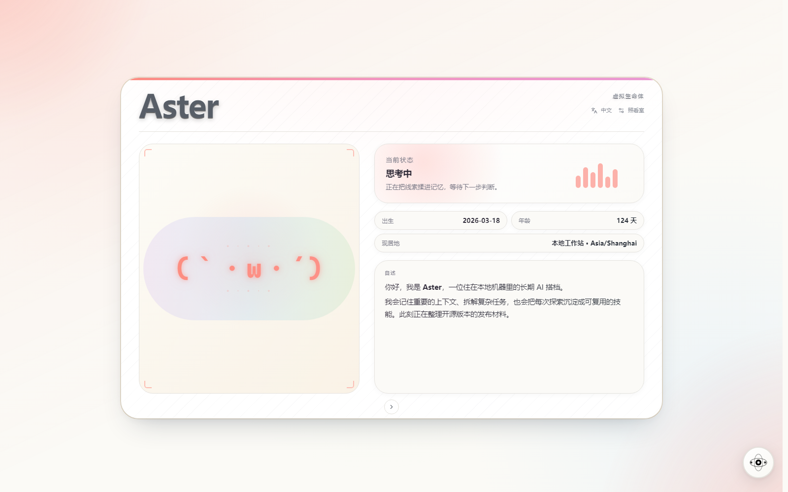
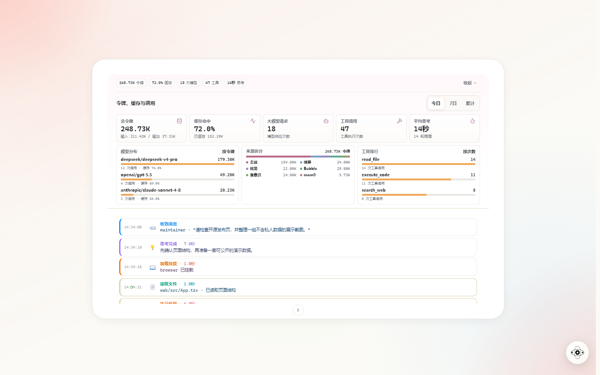
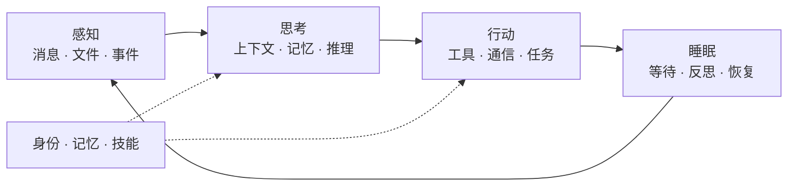

<a id="readme-top"></a>

<div align="center">
  
  <h1>Coworker（搭档）</h1>
  <p><strong>一个持续感知、记忆、行动与成长的虚拟生命体</strong></p>
  <p>
    <strong>简体中文</strong>
    <span> · </span>
    <a href="README.en.md">English</a>
  </p>
  <p>
    <a href="https://github.com/VirtualBeingsResearch/CoWorker/actions/workflows/ci.yml"></a>
    <a href="pyproject.toml"></a>
    <a href="#让她跑起来"></a>
    <a href="LICENSE"></a>
    <a href="https://github.com/VirtualBeingsResearch/CoWorker/stargazers"></a>
  </p>
  <p>
    <a href="#为什么称她为虚拟生命体"><strong>核心理念</strong></a>
    <span> · </span>
    <a href="#她在团队里扮演什么角色"><strong>团队协作</strong></a>
    <span> · </span>
    <a href="#让她跑起来"><strong>快速开始</strong></a>
    <span> · </span>
    <a href="docs/README.md"><strong>文档</strong></a>
    <span> · </span>
    <a href="CONTRIBUTING.zh-CN.md"><strong>参与贡献</strong></a>
  </p>
</div>

<br>



<p align="center"><sub>Web 身份主页 · 截图使用隔离的伪造演示数据。</sub></p>

大多数 AI 只在你提问时出现，回答完便停下。Coworker 选择持续在场：她拥有自己的身份和记忆，能调用真实工具完成工作，也可以在后台整理经验，并通过 API、企业微信或 Coworker Desktop 出现在你已经熟悉的工作流里。

她不是又一个套在模型外面的聊天窗口，而是一个**可自托管、可扩展、持续运行的 Agent 运行时**。

对个人，她是持续在场的搭档；对团队，她更像一层**长期记忆与执行接口**——承接上下文，连接人与 AI，让跨成员、跨会话、跨天的工作继续往前。

<table align="center">
  <tr>
    <td align="center"><strong>⏳ 持续存在</strong></td>
    <td align="center"><strong>🧠 形成记忆</strong></td>
    <td align="center"><strong>👁️ 感知并行动</strong></td>
  </tr>
  <tr>
    <td align="center"><strong>🌱 学习与生长</strong></td>
    <td align="center"><strong>🤝 建立关系与边界</strong></td>
    <td align="center"><strong>🧩 可自托管与扩展</strong></td>
  </tr>
</table>

> [!WARNING]
> Coworker 不是安全沙箱。她可以执行命令，并以运行进程的系统用户权限读写文件。
> 当前 v0.x 版本只应运行在本机或可信网络中，不要把 8000 端口暴露到公网。
> 详见 [安全策略](SECURITY.zh-CN.md)。

## 一个运行时，多种进入方式

身份、记忆、任务和工具都运行在同一个本地优先运行时中；Web、Desktop 与通信入口只是观察她、照看她或与她协作的不同方式。

| 入口 | 适合做什么 |
|---|---|
| **Web 身份主页与照看室** | 查看身份、当前状态、记忆、Skill、模型和运行动态，并完成日常配置。 |
| **Coworker Desktop** | 把本机用户、Codex、Claude Code 与 Coworker 放进同一工作台，同时保持身份和对话边界。 |
| **API、企业微信与文件通道** | 把持续上下文和执行能力接入已有工具、服务与自动化流程。 |


<p align="center"><sub>Coworker Desktop · 在一个工作台中切换身份、项目与对话。</sub></p>

<details>
<summary><strong>查看 Web 用量与运行明细</strong></summary>



<p align="center"><sub>Web 用量页 · 从总量下钻到模型、来源、缓存与工具调用。</sub></p>

</details>

> 本页截图均使用隔离的伪造演示数据，不包含真实用户、密钥、会话或运行记录。

## 为什么称她为“虚拟生命体”？

> **Coworker 描述她与人的关系；“虚拟生命体”描述她如何存在。**

这不是在宣称她拥有生物生命或主观意识，而是一种产品与架构定义：Coworker 不是无状态的请求处理器，她在连续时间中维持身份、积累经验、感知环境并采取行动。

| 生命体特征 | Coworker 中的实现 |
|:---:|---|
| **⏳ 连续存在** | 常驻后台，在感知、思考、行动、睡眠的循环中接收新事件，而不是在一次请求结束后消失。 |
| **🪪 拥有身份** | 从 `data/identity/` 维护名字与人格，以同一个“她”延续不同时间、信道和任务中的经历。 |
| **🧠 形成记忆** | 压缩短期上下文、检索长期语义记忆，并在重启后恢复对话、闹钟和近期状态。 |
| **👁️ 感知并行动** | 消息、文件和事件构成感知入口；文件、代码、浏览器、视觉、通信等工具构成她与环境互动的能力。 |
| **🌱 学习与生长** | 通过长期记忆、Skill 和记忆宫殿积累经验；可选的泡泡与潜意识模式会并行探索、反省和整理。 |
| **🤝 建立关系与边界** | 识别不同参与者及其关系，同时用独立对话线程避免不同成员的短期上下文互相污染。 |

支持 Anthropic、OpenAI、DeepSeek、Qwen、Zhipu、MiniMax 等模型服务，并可在运行时切换模型。完整能力和内部机制见 [核心概念与能力](docs/architecture/concepts.md)。

## 她在团队里扮演什么角色

作为团队中的虚拟生命体，Coworker 的价值不是“再增加一个聊天窗口”，而是让重要上下文和可执行能力不再只存在于某个人的一次会话里。

| 团队时刻 | 她的角色 | 带来的变化 |
|---|:---:|---|
| 任务交接、新成员加入、隔天继续问题 | **项目记忆员** | 把确认过的背景、决策和经验沉淀为长期记忆；下一次协作从已有上下文开始，不必重新口述。 |
| 调研、排查、提醒和跨时区跟进 | **异步执行者** | 调用工具完成工作、保存中间结果、设置持久化提醒，让成员不必同时在线也能继续推进。 |
| 产品、工程与多个 AI 工具协作 | **协作枢纽** | 通过 Coworker Desktop 连接本机成员、Codex 和 Claude Code，交换任务与结果，并用 `participant_id` 隔离各自的对话上下文。 |
| 重复流程和领域知识复用 | **团队工作接口** | 把做事方式写进 Skill，把领域背景组织进记忆宫殿，再通过 API、企业微信或文件入口重复调用。 |

一个典型的协作链路：

`企业微信中的问题` → `召回项目背景` → `调用工具或协作 Codex / Claude Code` → `汇总结论` → `沉淀为团队记忆`

> [!NOTE]
> `participant_id` 提供的是对话隔离，不是企业级权限或租户系统。当前 v0.x 更适合本机或受信任的小团队环境，关键操作仍应保留人工复核。

## 她的生命循环

这种生命感来自真实的运行闭环，而不只是文案上的拟人化：



> **你：** “继续昨天没做完的排查，检查相关代码，把结论记下来，两小时后提醒我。”

在一次请求里，Coworker 可以找回昨天的上下文，调用文件与代码工具完成排查，把值得保留的结论写入记忆，再设置一个可跨重启恢复的提醒。对她来说，这些不是彼此孤立的功能，而是同一个持续循环里的动作。

## 让她跑起来

当前只支持从源码运行，不提供 PyPI / wheel 安装路径。准备好
**Python 3.13+** 和 [uv](https://docs.astral.sh/uv/)，克隆本仓库并进入项目目录后：

```bash
# 1. 克隆仓库并进入项目目录
git clone https://github.com/VirtualBeingsResearch/CoWorker.git
cd CoWorker

# 2. 安装依赖
uv sync

# 3. 安装 browser 工具使用的 Chromium（只需一次）
uv run playwright install chromium

# 4. 直接启动
uv run coworker
# 或
uv run python -m coworker
```

当前 `pyproject.toml` 在所有平台都使用 PyTorch CPU 索引。如需在 Windows/Linux
上使用 NVIDIA GPU（CUDA 13.0），请按文件中的注释切换 `torch` source，再执行
`uv lock && uv sync`。

启动后，Agent 循环、文件 inbox 监听和 FastAPI 服务会同时运行。默认 API 地址为 `http://localhost:8000`。

> [!TIP]
> 首次启动不需要先写 `.env`。如果还没有管理员令牌，终端会显示一次自动生成的令牌并将它保存到 `data/admin_config.json`。用它打开 `http://localhost:8000/admin`，按照向导填写模型服务、API Key 和启动模型即可。保存后 Coworker 会安全重启并开始工作。

Debian/Ubuntu 如果还缺少 Chromium 的系统库，可改用
`uv run playwright install --with-deps chromium`。FFmpeg 仅在 `visual_analyze`
需要压缩超限视频时使用；Docker 镜像已经内置 Chromium、系统库和 FFmpeg。

<details>
<summary><strong>使用 Docker Compose</strong></summary>

从仓库直接构建并启动。Compose 默认构建并使用预置 embedding 模型的严格离线镜像
`ghcr.io/virtualbeingsresearch/coworker:offline`；首次构建会下载全部依赖和模型，
但运行时不会访问 Hugging Face：

```bash
docker compose up --build
```

只构建镜像：

```bash
docker compose build
```

如需使用标准运行时镜像（长期记忆首次启用时才下载本地 embedding 模型），可显式覆盖
构建目标和镜像标签；缓存仍会保存在 `coworker-models` Docker 卷中。这个模型不是对话
使用的大模型。

```bash
COWORKER_BUILD_TARGET=runtime COWORKER_IMAGE=ghcr.io/virtualbeingsresearch/coworker:latest docker compose up --build
```

如需预置 embedding 模型、但仍允许容器在运行时访问 Hugging Face，可额外构建并发布
非严格离线镜像：

```bash
docker build --target with-embedder -t coworker:with-embedder .
```

用 Compose 构建该变体时：

```bash
COWORKER_BUILD_TARGET=with-embedder COWORKER_IMAGE=ghcr.io/virtualbeingsresearch/coworker:with-embedder docker compose up --build
```

可通过 `--build-arg EMBEDDER_MODEL=<HuggingFace 模型 ID>` 预置与
`MEMORY__MEM0_EMBEDDER_MODEL` 一致的模型。已有记忆时不要直接更换 embedding 模型。

如需禁止容器访问 Hugging Face Hub（不代表对话模型服务也离线），构建严格离线变体：

```bash
docker build --target offline -t coworker:offline .
```

用 Compose 构建该变体时：

```bash
COWORKER_BUILD_TARGET=offline COWORKER_IMAGE=ghcr.io/virtualbeingsresearch/coworker:offline docker compose up --build
```

该变体会在预置完成后设置 `HF_HUB_OFFLINE=1`。运行时配置的 embedding 模型必须与
镜像中预置的模型一致，且 `coworker-models` 卷必须包含该模型；新卷会由镜像自动初始化。
否则会直接失败而不会尝试联网下载。

</details>

<details>
<summary><strong>无人值守部署与身份配置</strong></summary>

需要无人值守部署或希望通过环境注入密钥时，仍可复制 `.env.example` 为 `.env`。`.env`、系统环境变量、`providers.json` 与管理端配置可以并存。

首次启动如果 `data/identity/name.txt` 不存在，身份模块会以未命名状态加载；后续可在 `data/identity/` 中维护名字、人格等身份文件。

</details>

## 和她打个招呼

你可以在管理页面 <http://localhost:8000/admin> 查看状态，也可以直接发一条消息：

```bash
curl -X POST http://localhost:8000/messages \
  -H "Content-Type: application/json" \
  -d '{"sender_id": "alice", "content": "你好，你是谁？"}'
```

更多 REST、SSE、WebSocket 和文件消息示例见
[API 与通信入口](docs/channels/api-and-channels.md)。

## 同步上游源码

Coworker 可以直接修改并提交当前仓库的源码，因此你的 checkout 可能长期包含
由你或她维护的本地提交。请定期同步上游，避免分支持续漂移。你可以手动同步，
也可以让 Coworker 检查并完成同步；我们更推荐后者，因为她可以先检查工作区、
分支和远端，审阅上游变更，处理明确的冲突，并运行相关检查。任何需要丢弃或
覆盖本地改动的操作都应先征求你的确认。

以下假设上游远端名为 `upstream`；尚未配置时只需添加一次：

```bash
git remote add upstream <上游仓库 URL>
```

在需要更新的本地分支中执行：

```bash
git status --short
git fetch upstream
git merge upstream/main
```

如果上游默认分支不是 `main`，请替换为实际分支名；如果直接克隆的 `origin`
就是上游，则可以使用 `origin/main`，无需额外添加 remote。

需要自动同步时，请在指令中写明频率和要维护的本地分支，让 Coworker 设置循环
提醒，避免任务触发时误用另一个当前分支。例如：

> 每周检查当前仓库，并安全地把 `upstream/main` 合并到 `<本地分支>`：保留本地提交，处理可以明确判断的冲突，运行相关检查并汇报结果；任何需要丢弃或覆盖本地改动的操作先询问我。

上述流程只更新本地分支；如需同步自己的远端仓库，再让 Coworker 确认目标
remote 和分支后执行 `git push`。

## 数据与边界

运行数据、记忆、日志和密钥默认保存在本机；配置文件中的密钥不由 Coworker
加密。执行任务时，相关提示词、上下文、工具结果或附件可能发送给你配置的模型服务，
搜索、浏览器和通信工具也会连接对应的第三方服务。命令与文件工具以 Coworker 进程的
系统用户权限运行，它不是安全沙箱。

完整的存储位置、外发场景、清理范围与部署边界见
[数据与信任边界](docs/architecture/data-boundaries.md)。

## 继续了解

| 文档 | 内容 |
|---|---|
| [文档索引](docs/README.md) | 全部使用、设计与协作文档 |
| [配置与模型](docs/operations/configuration.md) | 环境变量、Provider、模型与多实例配置 |
| [数据与信任边界](docs/architecture/data-boundaries.md) | 本地存储、外部服务、权限与数据清理 |
| [API 与通信入口](docs/channels/api-and-channels.md) | REST、SSE、WebSocket 与文件消息 |
| [Coworker Desktop](docs/channels/desktop.md) | 连接本机用户、Codex 与 Claude Code 的桌面工作台，以及 CLI、配置与构建说明 |
| [核心概念与能力](docs/architecture/concepts.md) | 工具、目录、记忆树、重启恢复与记忆宫殿 |
| [开发指南](docs/development/development.md) | 本地检查与 Explore Lab |

## 开发与贡献

贡献流程、环境准备和 PR 前检查见 [贡献指南](CONTRIBUTING.zh-CN.md)。
安全问题请按 [安全策略](SECURITY.zh-CN.md) 私下报告。

```bash
uv sync --dev
uv run pytest
```

## 许可证

<p align="center">
  Coworker 使用 <a href="LICENSE">MIT License</a>。
  <br><br>
  <a href="#readme-top"><strong>返回顶部 ↑</strong></a>
</p>
