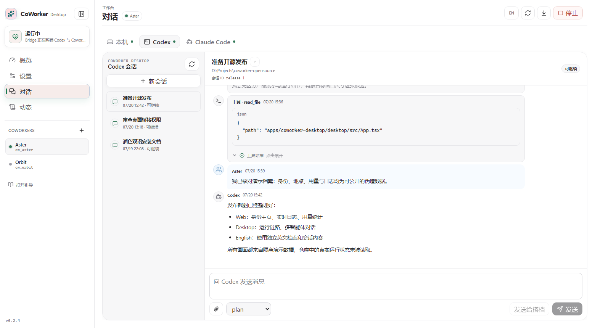

# Coworker Desktop

中文 · [English](desktop.en.md)

[← 返回通信与客户端](README.md)

Coworker Desktop 是一个本机协作工作台：它把本机用户、Codex、Claude Code 与一个或多个 Coworker 放进同一界面，同时保留彼此独立的身份、项目和对话上下文。你可以查看连接状态、切换身份、继续已有会话，并在明确需要时把结果发送给 Coworker。

## 桌面端一览



<p align="center"><sub>左侧管理运行状态与 Coworker，中间切换身份和会话，右侧查看对话与工具活动。</sub></p>

截图使用隔离的伪造演示数据，不包含真实用户、密钥、会话或运行记录。

界面中的本机用户、Codex 与 Claude Code 是三个独立的 `actor` 身份。`participant` 决定目标身份，会话由 `actor` 与 `conversation_id` 共同寻址；AI 的普通 `final` 只留在本机会话，只有显式调用 `send_to_coworker` 才会通知 Coworker。

Coworker Desktop 有两种分发/运行方式：

- **CLI**：`coworker-desktop`，适合开发、脚本、服务化和问题排查。
- **桌面版**：`apps/coworker-desktop/desktop`，基于 Tauri，提供配置、启动/停止、状态、日志和诊断界面；用于面向普通本机用户的安装包分发。

桌面版不内置 Coworker Python 服务、Codex CLI 或 Claude Code CLI。唯一配置入口是 schema v2 的 `coworker_desktop.json`。Codex/Claude 分别健康检查，任一缺失都不会阻止本机聊天及其他可用 actor 启动。

## 本页导航

- [CLI 运行](#cli-运行)：配置并启动 bridge。
- [桌面版运行和打包](#桌面版运行和打包)：开发运行与安装包构建。
- [产品版本管理](#产品版本管理)：同步版本号并生成变更记录。
- [桌面自动更新发布](#桌面自动更新发布)：签名、清单与发布流程。

## CLI 运行

1. 准备 bridge 配置文件：

```bash
cargo run --bin coworker-desktop
```

如果当前目录没有 `coworker_desktop.json`，CLI 会启动首次配置向导。默认是生产模式，要求每个 Coworker 使用 HTTPS 和 Bearer token；只有为本机调试显式设置 `security.development_mode=true` 才允许免鉴权 HTTP。

也可以手动复制示例配置，或用 `--config` 指定自定义路径：

```bash
cp coworker_desktop.json.example coworker_desktop.json
cargo run --bin coworker-desktop -- --config coworker_desktop.json
```

多 Coworker 配置示例：

```json
{
  "schema_version": 2,
  "desktop_id": "desktop-local",
  "display_name": "My Desktop",
  "storage_dir": "data/coworker_desktop",
  "coworkers": [
    {
      "coworker_id": "cw_01",
      "display_name": "搭档A",
      "base_url": "https://coworker.example.com",
      "bearer_token": "replace-with-a-long-random-token"
    },
    {
      "coworker_id": "cw_02",
      "display_name": "搭档B",
      "base_url": "https://coworker-2.example.com",
      "bearer_token": "replace-with-another-long-random-token"
    }
  ],
  "actors": {
    "local": {"enabled": true},
    "codex": {
      "enabled": true,
      "codex_id": "codex-local",
      "snapshot_thread_limit": 20,
      "snapshot_scan_thread_limit": 200
    },
    "claude": {"enabled": true}
  },
  "security": {"development_mode": false}
}
```

本机 HTTP 调试时，在确认服务仅监听回环地址后，手动改为
`"security": {"development_mode": true}`，并在 Coworker 端同步设置
`API__DEVELOPMENT_MODE=true`；不要把该配置用于共享网络。

配置必须使用 `schema_version=2` 且包含非空 `coworkers` 数组；顶层旧 Coworker 字段不会参与生成新配置。

Bridge 会同时输出控制台日志和文件日志。默认控制台和文件级别均为 `INFO`，文件按天写入 `logs_dir/coworker_desktop.YYYY-MM-DD.log` 并保留最近 7 份，用于排查启动、SSE、命令、thread、approval/user input、动态工具和转发异常。Tauri 桌面端固定使用系统应用日志目录，避免配置切换后读写不同文件。

`desktop.actor.snapshot` 会先从 actor 扫描最多 `snapshot_scan_thread_limit` 个会话，再按项目写入 `projects[].recent_conversations`，并且每个项目只主动展示最近 `snapshot_thread_limit` 个会话。Snapshot 不再提供扁平 `conversations`；需要完整列表时通过 `communicate(..., extra={"operation":"list_conversations"})` 被动查询。

当 Codex turn 以 `interrupted` 状态结束时，Bridge 默认会用 `auto_continue_interrupted_message` 自动发起一次续跑，单个 thread 连续最多尝试 `auto_continue_interrupted_max_attempts` 次；如需完全关闭，设置 `auto_continue_interrupted_turns=false`。

2. 先启动 Coworker，再启动 Bridge：

```bash
uv run coworker
cargo run --bin coworker-desktop
```

Desktop 启动后只为健康检查通过的身份注册 `coworker-desktop` participant，并启动周期性的 `desktop.actor.snapshot`。每个 actor 每轮只扫描一次近期会话，优先使用原生项目标识进行分组并限制每个项目主动展示的数量；无项目会话统一归入“对话”组。相同 snapshot 会跳过重复发布，但最多 5 分钟发送一次恢复心跳；一个 Coworker 发布失败不会阻塞其他 Coworker。Coworker 会把三个身份的连接状态与项目会话写入 pinned context，并为 Desktop 来源消息自动加载 `coworker-desktop` Skill。完整列表仍通过 `list_conversations` 查询。

## 桌面版运行和打包

Tauri 桌面版位于 `apps/coworker-desktop/desktop`，Rust 入口位于 `apps/coworker-desktop/desktop/src-tauri`。CLI/bridge 核心位于 `apps/coworker-desktop/bridge`。

## 产品版本管理

仓库使用根目录 `VERSION` 作为唯一产品版本源。Coworker Python 包、Rust workspace、Coworker Desktop、Web 包和 Tauri 配置都必须与它保持一致。

```bash
# 更新版本、同步各 manifest/package-lock 顶层版本，并自动补充 changelog
uv run python scripts/bump_version.py 0.2.0

# CI 同款校验；tag 构建时会额外校验 vX.Y.Z 与 VERSION 一致
uv run python scripts/check_version.py
```

`bump_version.py` 会优先使用最近的 `vX.Y.Z` tag 之后的提交补充 `CHANGELOG.md`；迁移期间也会识别历史 `coworker-desktop-vX.Y.Z` tag。没有 release tag 时，退回到上一次修改 `VERSION` 的提交之后。已有人工内容的版本段不会被覆盖。确认 `CHANGELOG.md` 后，使用 `vX.Y.Z` tag 触发桌面与容器发布流程。

开发运行：

```bash
cd apps/coworker-desktop/desktop
npm install
npm run tauri -- dev
```

构建前端：

```bash
cd apps/coworker-desktop/desktop
npm install
npm run build
```

打包桌面应用需要在目标平台或对应构建机上执行。`npm run build` 只构建前端静态资源；安装包需要走 Tauri build。

```bash
cd apps/coworker-desktop/desktop
npm run tauri -- build
```

按平台显式指定 bundle：

```bash
# Windows 构建机：生成 NSIS installer
npm run tauri -- build --bundles nsis

# macOS 构建机：生成 Apple Silicon .app/.dmg，并产出 updater 用的 .app.tar.gz/.sig
npm run tauri -- build --bundles app,dmg --target aarch64-apple-darwin

# macOS 构建机：生成 Intel x86_64 .app/.dmg，并产出 updater 用的 .app.tar.gz/.sig
npm run tauri -- build --bundles app,dmg --target x86_64-apple-darwin

# Linux 构建机：生成 AppImage 和 deb
npm run tauri -- build --bundles appimage,deb
```

当前 Tauri 配置声明的 bundle 目标包括 Windows `nsis`、macOS `dmg`、Linux `appimage`/`deb`。macOS 自动更新还需要显式构建 `app` target，否则只生成 dmg，不会生成 updater 用的 `.app.tar.gz`。Tauri 不会在 Windows 本机直接产出 macOS/Linux 安装包；跨平台包通常应在对应平台构建机或 CI runner 上生成。

macOS 正式分发需要 Developer ID 签名和 notarization；Linux 打包需要安装 Tauri 所需的 WebKitGTK/AppIndicator 等系统依赖。

推荐使用 GitHub Actions 生成三平台 artifact：

```text
.github/workflows/coworker-desktop-release.yml
```

该 workflow 支持手动触发，也会在推送 `v*` tag 时运行：

- `windows-latest`：生成 NSIS installer
- `macos-latest`：分别生成 Apple Silicon `aarch64-apple-darwin` 和 Intel `x86_64-apple-darwin` `.app`/dmg/updater artifact；配置 Apple secrets 后会签名，并可公证
- `ubuntu-22.04`：生成 AppImage 和 deb

推荐从 Actions 手动运行 `.github/workflows/release.yml` 中的 `Create CoWorker Release`：选择要发布的 ref，输入 `vX.Y.Z` tag，并按需选择是否尝试 macOS 公证。流程会先确认 tag 与 `VERSION` 一致，再在所选提交上创建 tag，并显式启动桌面与容器发布 workflow。同一 tag 的流程可以安全重跑，但已指向其他提交的 tag 会被拒绝。也可以像以前一样直接推送 `v*` tag，让两个发布 workflow 自动运行。

直接从分支手动运行桌面 workflow 只生成 Actions artifact；从 tag 运行或由统一发布入口调度时，所有平台构建成功后，workflow 会创建使用 GitHub 自动说明的 Release 草稿，维护者检查后再手工公开。草稿包含 Windows EXE、两架构 macOS dmg、Linux AppImage/deb、各平台 updater 与签名，以及覆盖全部文件的 `SHA256SUMS.txt`。重跑会更新同 tag 的草稿资产，但不会修改已经公开的 Release。

macOS 签名/公证不需要把 Apple 私钥提交到仓库。把证书和 Apple 凭据放到 GitHub
Repository Secrets 后，workflow 会在 macOS runner 的临时 keychain 中导入证书，构建结束后随 runner 销毁。

签名所需 secrets：

- `APPLE_CERTIFICATE`：Developer ID Application `.p12` 文件的 base64 内容
- `APPLE_CERTIFICATE_PASSWORD`：导出 `.p12` 时设置的密码
- `APPLE_SIGNING_IDENTITY`：可选；证书 identity 名称，不填则自动取导入 keychain 中的第一个 codesigning identity
- `KEYCHAIN_PASSWORD`：可选；CI 临时 keychain 密码，不填则自动生成

公证推荐使用 App Store Connect API key：

- `APPLE_API_ISSUER`：Issuer ID
- `APPLE_API_KEY`：Key ID
- `APPLE_API_KEY_P8_BASE64`：`AuthKey_<Key ID>.p8` 私钥文件的 base64 内容

也可以使用 Apple ID app-specific password 作为备用公证凭据：

- `APPLE_ID`
- `APPLE_PASSWORD`
- `APPLE_TEAM_ID`

在没有 Apple secrets 的情况下，macOS job 仍会产出未签名 dmg，适合先验证构建链路。手动触发
workflow 时可以关闭 `notarize_macos`，用于先验证证书导入和签名，不向 Apple 提交公证请求。

## 桌面自动更新发布

桌面端使用 Tauri v2 updater。更新签名不能关闭，因此需要先生成 updater key pair。仓库里的
`tauri.conf.json` 保留占位公钥；release workflow 会在构建前用 `scripts/configure_tauri_updater.py`
把真实公钥和 Coworker 更新 endpoint 注入配置。私钥只放到 CI secret。

```bash
cd apps/coworker-desktop/desktop
npm run tauri -- signer generate -- -w ~/.tauri/coworker-desktop.key
```

GitHub Secrets：

- `TAURI_SIGNING_PRIVATE_KEY`：上面生成的私钥路径或私钥内容
- `TAURI_SIGNING_PRIVATE_KEY_PASSWORD`：可选；私钥密码
- `TAURI_UPDATER_PUBLIC_KEY`：上面生成的公钥
- `TAURI_UPDATER_ENDPOINT`：例如 `https://coworker.example.com/api/desktop-updates/{{target}}/{{arch}}/{{current_version}}`；也可以只填 `https://coworker.example.com`，脚本会自动补上 updater 路径和 Tauri 占位符。

Tauri release build 会生成 updater asset 和 `.sig`。按平台通常使用：

- Windows：`*.exe` 与 `*.exe.sig`
- macOS Apple Silicon：`target/aarch64-apple-darwin/release/bundle/macos/*.app.tar.gz` 与 `.sig`
- macOS Intel x86_64：`target/x86_64-apple-darwin/release/bundle/macos/*.app.tar.gz` 与 `.sig`
- Linux：`*.AppImage` 与 `*.AppImage.sig`

Tag 构建会把这些 updater 文件和签名一并附加到 GitHub Release 草稿，便于审核、归档或下载后上传到 Coworker 更新服务；GitHub 草稿本身不会改写服务端 `latest.json`，也不会向客户端发布更新。

如果 macOS 两个架构的 updater 都叫 `app.tar.gz`，上传接口会在服务端保存为
`darwin-aarch64-app.tar.gz` / `darwin-x86_64-app.tar.gz`，避免同一版本 assets
目录和下载 URL 撞名；已有架构标识的文件名会保持不变。

Coworker 服务端维护 release 目录和 `latest.json`。配置：

```env
DESKTOP_UPDATES__DIR=data/desktop_updates
DESKTOP_UPDATES__ADMIN_TOKEN=change-me
```

上传签名产物并发布：通过管理员界面进行发布管理

也可以用 `examples/api_test.html` 的 Desktop Release 区域手工创建 release、上传单个平台 asset、publish 或 rollback。
桌面端启动后会请求 `GET /api/desktop-updates/{{target}}/{{arch}}/{{current_version}}`；无更新返回 `204`，有更新返回 Tauri updater 需要的 `version/url/signature`。

人工调用 `publish` 或 `rollback` 后，服务端还会通过现有 Desktop SSE 连接向支持
`desktop_update_push` 的在线桌面端发送一次检查更新请求。发布响应中的
`push.eligible` / `push.enqueued` 分别表示符合条件和已进入在线 SSE 队列的桌面数量；
它们不代表离线送达。Bridge 已停止、客户端断网或桌面端退出时不会保留推送，客户端会在
下次启动时通过上述 updater endpoint 补做检查。推送只触发签名更新检查，不会自动安装；
用户确认安装后桌面端才会重启。

1. Coworker 通过 `communicate` 发给 Desktop snapshot 对应的 `coworker-desktop` participant。`conversation_id` 表示该 actor 下的会话；不传时会创建新会话。不传 `extra.project_path` / `extra.cwd` 时，新 Codex thread 会作为 no-project chat 启动；传入时会作为项目 cwd 发送给 Codex app-server。

新建 thread：

```python
communicate(
    participant_id=desktop_participant_id,
    message="请帮我检查这个改动。",
    extra={"mode": "default", "origin_participant_id": "alice", "project_path": "D:/work/repo"},
)
```

继续已有 thread：

```python
communicate(
    participant_id=desktop_participant_id,
    conversation_id="thr_xxx",
    message="继续看这个问题。",
)
```

发送附件：

```python
communicate(
    participant_id=desktop_participant_id,
    conversation_id="thr_xxx",
    message="请看这个文件。",
    attachments=[{"path": "reports/notes.md"}],
)
```

`extra.mode` 可选，取值为 `"plan"` 或 `"default"`。Bridge 会通过 Codex app-server 的 mode 列表解析可用 mode，并只在 `turn/start` 时传入；如果当前 thread 正在活跃 turn 中，Codex 需要走追加输入，本次消息不能同时切换模式。

查询 thread 列表（被动查询，不触发主动 snapshot 扩大）：

```python
communicate(
    participant_id=desktop_participant_id,
    extra={
        "operation": "list_conversations",
        "filter": {"project_id": "coworker", "limit": 50},
    },
)
```

`limit` 缺省为 50；结果按 `projects[].recent_conversations` 分组返回，完整性由 `conversation_scan.complete` 和项目级统计字段描述。

刷新 Codex app-server schema 时需要包含 experimental 字段，否则 schema 中会缺少 `collaborationMode/list` 和 `turn/start.collaborationMode`：

```powershell
codex app-server generate-json-schema --experimental --out scratch\codex-app-schema
```

也可以只排队切换模式，让下一次 `turn/start` 生效：

```python
communicate(
    participant_id=desktop_participant_id,
    conversation_id="thr_xxx",
    extra={"operation": "set_conversation_mode", "mode": "plan"},
)
```

Bridge 会把消息包装成类似下面的格式发给 Codex，`Coworker:<id>` 就是 Codex 回复时要使用的目标 id：

```text
[来自Coworker:cw_01][搭档A]的消息:
请帮我检查这个改动。
```

4. Codex 回复 Coworker：

- Bridge 通过 app-server 的 `dynamicTools` 注册动态工具。Codex 应调用 `list_coworkers()` 查看可通信 Coworker，并用 `send_to_coworker(coworker_id, message, attachments=[...])` 主动发消息。
- 对于无法注入动态工具的历史 thread，仍保留 frontmatter 文本工具；解析后的消息同样通过 Desktop v1 outbox/ACK 链路发送。

发送消息给 Coworker：

```markdown
---
type: coworker_tool_call
tool: send_to_coworker
to: cw_01
---
这里是要发给 Coworker 的内容。
```

查看可通信 Coworker：

```markdown
---
type: coworker_tool_call
tool: list_coworkers
---
```

Bridge 不解析自然语言兜底；未知 `coworker_id` 会失败且不会发送。新建的 Coworker thread 优先使用动态工具，避免重复发送。

5. Codex app-server 请求 Coworker 输入：

- `desktop.actor.snapshot` 只使用 `projects[].recent_conversations`，项目会包含 matched/shown/truncated/complete 等统计。
- command/file/permissions approval 会以 `desktop.approval.requested` 通知 Coworker。Bridge 默认安全拒绝，不自动批准；显式开启 Coworker 代审后，会等待 `communicate(..., extra={"operation":"resolve_request", ...})` 回复。
- `item/tool/requestUserInput` 和 `mcpServer/elicitation/request` 会以 `desktop.user_input.requested` 通知 Coworker。

审批配置借鉴 Codex 的权限边界和审批者分离模型：`permissions_mode` 描述权限边界，`approvals_reviewer` 描述谁审批。当前安全默认等价于“通知但拒绝”：

```json
{
  "permissions_mode": "read-only",
  "approvals_reviewer": "none",
  "approval_timeout_seconds": 300
}
```

让 Coworker 代审审批请求：

```json
{
  "permissions_mode": "workspace-write",
  "approvals_reviewer": "coworker",
  "approval_timeout_seconds": 300
}
```

高风险完全访问模式会绕过审批并直接批准：

```json
{
  "permissions_mode": "danger-full-access",
  "approvals_reviewer": "none"
}
```

`approvals_reviewer=none` 表示不等待审批回复：`read-only` / `workspace-write` 会立即拒绝审批请求，`danger-full-access` 会直接批准。`approvals_reviewer=coworker` 表示审批请求会等待 Coworker 回复；超时后 fail closed。

当 `desktop.approval.requested` 不带 `decision` 且 `status=pending` 时，Coworker 可用 `response` 回复。例如 command/file 审批：

```python
communicate(
    participant_id=desktop_participant_id,
    extra={
        "operation": "resolve_request",
        "server_request_id": "srv_approval_001",
        "response": {"decision": "accept"},
    },
)
```

permissions 审批直接返回 app-server permissions response：

```python
communicate(
    participant_id=desktop_participant_id,
    extra={
        "operation": "resolve_request",
        "server_request_id": "srv_approval_002",
        "response": {
            "permissions": {
                "fileSystem": {"entries": []},
                "network": {"enabled": False},
            },
            "scope": "turn",
            "strictAutoReview": True,
        },
    },
)
```

`item/tool/requestUserInput` 使用 `answers` 对象回复；`answers` 的 key 必须对应请求里的 `params.questions[].id`：

```python
communicate(
    participant_id=desktop_participant_id,
    extra={
        "operation": "resolve_request",
        "server_request_id": "srv_1",
        "answers": {"choice": {"answers": ["选项A"]}},
    },
)
```

`mcpServer/elicitation/request` 使用 `response` 对象回复，Bridge 会把该对象原样传回 Codex app-server：

```python
communicate(
    participant_id=desktop_participant_id,
    extra={
        "operation": "resolve_request",
        "server_request_id": "srv_2",
        "response": {"action": "accept", "content": {"ok": True}},
    },
)
```

Codex 通过 Bridge 发回 Coworker 的普通消息会以 `sender_id=codex:<codex_id>` 和 `conversation_id=<thread_id>` 进入 Coworker inbox，并标记为 `source=codex`。
